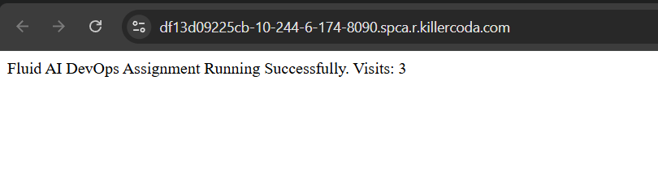
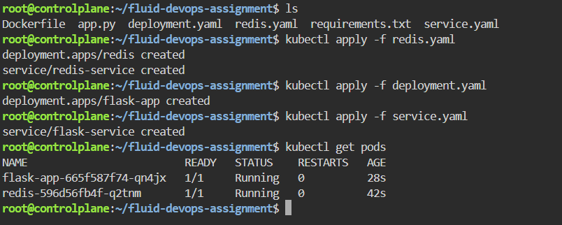
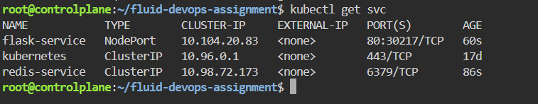
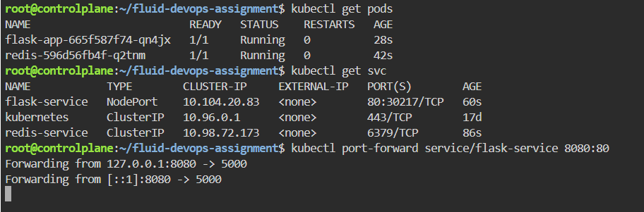
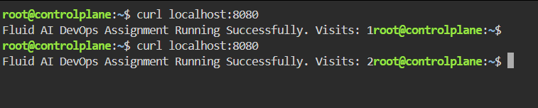

# Kubernetes Flask Redis CI/CD Project


## Project Overview

This project demonstrates a production-style deployment of a Flask application with Redis on Kubernetes.

The application is containerized using Docker and deployed using Kubernetes manifests. A GitHub Actions CI/CD pipeline automatically builds and pushes Docker images to Docker Hub.

The project focuses on infrastructure automation, deployment reliability, containerization, Kubernetes operations, and troubleshooting.

---

## Architecture

```text
User
 │
 ▼
Flask Application
 │
 ▼
Redis Service
 │
 ▼
Kubernetes Cluster
```

---

## Technologies Used

- Python (Flask)
- Redis
- Docker
- Kubernetes
- GitHub Actions
- Docker Hub

---

## Features

- Containerized Flask application
- Redis service dependency
- Kubernetes Deployment and Service
- Automated CI/CD pipeline
- Docker image build and push automation
- Readiness Probe
- Liveness Probe
- Failure simulation and debugging
- Production-style deployment workflow

---

## Project Structure

```text
.
├── app.py
├── Dockerfile
├── requirements.txt
├── deployment.yaml
├── service.yaml
├── redis.yaml
├── screenshots/
└── .github/workflows/deploy.yml
```

---

## CI/CD Pipeline

The GitHub Actions workflow automatically:

1. Checks out source code
2. Builds the Docker image
3. Pushes the image to Docker Hub

This ensures every code change is automatically packaged and delivered.

---

## Reliability Improvement

### Readiness Probe

Ensures traffic is routed only to healthy application instances.

### Liveness Probe

Automatically restarts unhealthy containers.

### Benefits

- Faster failure detection
- Improved application availability
- Automatic recovery
- Better deployment reliability

### Tradeoff

Incorrect probe configuration may cause false failures or unnecessary restarts.

---

## Failure Simulation & Debugging

An intentional readiness probe misconfiguration was introduced to demonstrate troubleshooting methodology.

### Failure

The readiness probe path was changed from:

```yaml
path: /health
```

to:

```yaml
path: /wrong
```

### Investigation Commands

```bash
kubectl get pods
kubectl describe pod <pod-name>
kubectl logs <pod-name>
```

### Root Cause

Kubernetes was checking an invalid health endpoint and continuously marked the pod as unhealthy.

### Resolution

The readiness probe path was corrected back to:

```yaml
path: /health
```

and the deployment recovered successfully.

---

## Screenshots

### Application Running



### Kubernetes Pods



### Kubernetes Services



### Port Forwarding



### Application Verification using Curl



---

## Learning Outcomes

Through this project I gained hands-on experience with:

- Docker Containerization
- Kubernetes Deployments and Services
- Kubernetes Health Probes
- GitHub Actions CI/CD
- Docker Hub Integration
- Application Troubleshooting
- Kubernetes Debugging
- Production Deployment Concepts

---

## Future Improvements

- Helm Charts
- Horizontal Pod Autoscaling (HPA)
- Prometheus Monitoring
- Grafana Dashboards
- Ingress Controller
- Secrets Management
- ArgoCD GitOps Deployment

---

## Author

**Manali Gawade**

Cloud & DevOps Engineer

LinkedIn: linkedin.com/in/manali-gawade-b3660225a

---

## Project Highlights

✅ Dockerized Application

✅ Kubernetes Deployment

✅ Redis Integration

✅ GitHub Actions CI/CD

✅ Readiness & Liveness Probes

✅ Failure Simulation & Debugging

✅ Production-Style DevOps Workflow
